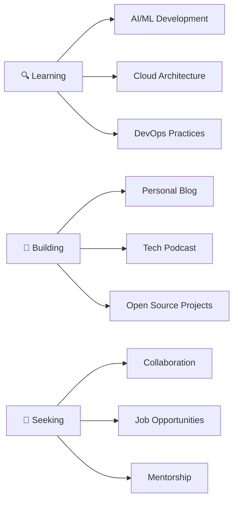

<div align="center">

# 🌟 Hey there my name is Otsile Earl Kole 

### 🚀 Passionate Developer | AI Enthusiast | Problem Solver from South Africa 🇿🇦

<p align="center">
  
</p>

[](https://github.com/3arlN3t)
[](https://github.com/3arlN3t)
[](https://github.com/3arlN3t)

</div>

---

## 🎯 About Me


```yaml
Name: Otsile Earl Kole
Location: South Africa 🇿🇦
Role: Full Stack Developer
Focus: Building innovative solutions with modern tech
Mindset: Continuous Learner & Growth-Oriented
Passion: AI, Web Development & Open Source
```

### 🌱 What I'm Up To

- 🔭 **Currently Building:** My personal blog and content platform
- 🎙️ **Planning:** To venture into tech podcasting - watch this space!
- 📱 **Social:** Sharing thoughts and insights on [Twitter](https://twitter.com/3arlN3t)
- 🎥 **Content:** Developing my [YouTube](https://youtube.com/@3arlN3t) channel
- 💼 **Open to:** New opportunities and collaborations via [LinkedIn](https://linkedin.com/in/3arlN3t)
- ⚡ **Fun Fact:** Proudly representing the African tech community!

---

### 📊 GitHub Analytics Dashboard
<p align="center">
  
  
</p>

### 📊 Statistics Overview
<p align="center">
  
  
</p>

<p align="center">
  
  
</p>

### 🔥 Contribution Streak
<p align="center">
  
</p>

### 📈 Contribution Graph
<p align="center">
  
</p>

### 📈 Activity Timeline
<p align="center">
  
</p>
### 🏆 GitHub Trophies
<p align="center">
  
</p>

</div>

---

<br>
<h2 align="center" id="3arlN3t-tech">💻 Favorite Technologies</h2>

<p align="center">
  <em>Tools, languages, frameworks and technologies that I love working with</em>
</p>

## 🛠️ Tech Stack & Skills

<div align="center">

<table width="100%">
<tr>
<td width="20%" valign="top">

### 🎨 Frontend
<table align="center">
  <tr>
    <td align="center" width="80">
      <a href="#3arlN3t-frontend">
        
      </a>
      <br><strong>JavaScript</strong>
      <br>⭐⭐⭐⭐⭐
      <br><small>Expert</small>
    </td>
  </tr>
  <tr>
    <td align="center" width="80">
      <a href="#3arlN3t-frontend">
        
      </a>
      <br><strong>TypeScript</strong>
      <br>⭐⭐⭐⭐⚬
      <br><small>Advanced</small>
    </td>
  </tr>
  <tr>
    <td align="center" width="80">
      <a href="#3arlN3t-frontend">
        
      </a>
      <br><strong>React</strong>
      <br>⭐⭐⭐⭐⭐
      <br><small>Expert</small>
    </td>
  </tr>
  <tr>
    <td align="center" width="80">
      <a href="#3arlN3t-frontend">
        
      </a>
      <br><strong>Next.js</strong>
      <br>⭐⭐⭐⭐⚬
      <br><small>Advanced</small>
    </td>
  </tr>
  <tr>
    <td align="center" width="80">
      <a href="#3arlN3t-frontend">
        
      </a>
      <br><strong>TailwindCSS</strong>
      <br>⭐⭐⭐⭐⚬
      <br><small>Advanced</small>
    </td>
  </tr>
  <tr>
    <td align="center" width="80">
      <a href="#3arlN3t-frontend">
        
      </a>
      <br><strong>Bootstrap</strong>
      <br>⭐⭐⭐⚬⚬
      <br><small>Intermediate</small>
    </td>
  </tr>
  <tr>
    <td align="center" width="80">
      <a href="#3arlN3t-frontend">
        
      </a>
      <br><strong>Redux</strong>
      <br>⭐⭐⭐⭐⚬
      <br><small>Advanced</small>
    </td>
  </tr>
  <tr>
    <td align="center" width="80">
      <a href="#3arlN3t-frontend">
        
      </a>
      <br><strong>Material-UI</strong>
      <br>⭐⭐⭐⚬⚬
      <br><small>Intermediate</small>
    </td>
  </tr>
</table>

</td>
<td width="20%" valign="top">

### ⚙️ Backend
<table align="center">
  <tr>
    <td align="center" width="80">
      <a href="#3arlN3t-backend">
        
      </a>
      <br><strong>Python</strong>
      <br>⭐⭐⭐⭐⭐
      <br><small>Expert</small>
    </td>
  </tr>
  <tr>
    <td align="center" width="80">
      <a href="#3arlN3t-backend">
        
      </a>
      <br><strong>Django</strong>
      <br>⭐⭐⭐⭐⚬
      <br><small>Advanced</small>
    </td>
  </tr>
  <tr>
    <td align="center" width="80">
      <a href="#3arlN3t-backend">
        
      </a>
      <br><strong>Node.js</strong>
      <br>⭐⭐⭐⭐⚬
      <br><small>Advanced</small>
    </td>
  </tr>
  <tr>
    <td align="center" width="80">
      <a href="#3arlN3t-backend">
        
      </a>
      <br><strong>Flask</strong>
      <br>⭐⭐⭐⚬⚬
      <br><small>Intermediate</small>
    </td>
  </tr>
  <tr>
    <td align="center" width="80">
      <a href="#3arlN3t-backend">
        
      </a>
      <br><strong>PHP</strong>
      <br>⭐⭐⭐⚬⚬
      <br><small>Intermediate</small>
    </td>
  </tr>
  <tr>
    <td align="center" width="80">
      <a href="#3arlN3t-backend">
        
      </a>
      <br><strong>GraphQL</strong>
      <br>⭐⭐⭐⚬⚬
      <br><small>Intermediate</small>
    </td>
  </tr>
  <tr>
    <td align="center" width="80">
      <a href="#3arlN3t-backend">
        
      </a>
      <br><strong>C</strong>
      <br>⭐⭐⭐⚬⚬
      <br><small>Intermediate</small>
    </td>
  </tr>
  <tr>
    <td align="center" width="80">
      <a href="#3arlN3t-backend">
        
      </a>
      <br><strong>MongoDB</strong>
      <br>⭐⭐⭐⭐⚬
      <br><small>Advanced</small>
    </td>
  </tr>
</table>

</td>
<td width="20%" valign="top">

### ☁️ Cloud & DevOps
<table align="center">
  <tr>
    <td align="center" width="80">
      <a href="#3arlN3t-cloud">
        
      </a>
      <br><strong>Azure</strong>
      <br>⭐⭐⭐⭐⚬
      <br><small>Advanced</small>
    </td>
  </tr>
  <tr>
    <td align="center" width="80">
      <a href="#3arlN3t-cloud">
        
      </a>
      <br><strong>Google Cloud</strong>
      <br>⭐⭐⭐⚬⚬
      <br><small>Intermediate</small>
    </td>
  </tr>
  <tr>
    <td align="center" width="80">
      <a href="#3arlN3t-cloud">
        
      </a>
      <br><strong>Firebase</strong>
      <br>⭐⭐⭐⭐⚬
      <br><small>Advanced</small>
    </td>
  </tr>
  <tr>
    <td align="center" width="80">
      <a href="#3arlN3t-cloud">
        
      </a>
      <br><strong>Linux</strong>
      <br>⭐⭐⭐⭐⚬
      <br><small>Advanced</small>
    </td>
  </tr>
  <tr>
    <td align="center" width="80">
      <a href="#3arlN3t-cloud">
        
      </a>
      <br><strong>Docker</strong>
      <br>⭐⭐⭐⚬⚬
      <br><small>Intermediate</small>
    </td>
  </tr>
</table>

</td>
<td width="20%" valign="top">

### 🛠️ Tools
<table align="center">
  <tr>
    <td align="center" width="80">
      <a href="#3arlN3t-tools">
        
      </a>
      <br><strong>Git</strong>
      <br>⭐⭐⭐⭐⭐
      <br><small>Expert</small>
    </td>
  </tr>
  <tr>
    <td align="center" width="80">
      <a href="#3arlN3t-tools">
        
      </a>
      <br><strong>Figma</strong>
      <br>⭐⭐⭐⭐⚬
      <br><small>Advanced</small>
    </td>
  </tr>
  <tr>
    <td align="center" width="80">
      <a href="#3arlN3t-tools">
        
      </a>
      <br><strong>Bash</strong>
      <br>⭐⭐⭐⚬⚬
      <br><small>Intermediate</small>
    </td>
  </tr>
  <tr>
    <td align="center" width="80">
      <a href="#3arlN3t-tools">
        
      </a>
      <br><strong>WordPress</strong>
      <br>⭐⭐⭐⚬⚬
      <br><small>Intermediate</small>
    </td>
  </tr>
  <tr>
    <td align="center" width="80">
      <a href="#3arlN3t-tools">
        
      </a>
      <br><strong>VS Code</strong>
      <br>⭐⭐⭐⭐⭐
      <br><small>Expert</small>
    </td>
  </tr>
</table>

</td>
<td width="20%" valign="top">

### 🤖 AI & Frameworks
<table align="center">
  <tr>
    <td align="center" width="80">
      <a href="#3arlN3t-ai">
        
      </a>
      <br><strong>TensorFlow</strong>
      <br>⭐⭐⭐⚬⚬
      <br><small>Learning</small>
    </td>
  </tr>
  <tr>
    <td align="center" width="80">
      <a href="#3arlN3t-ai">
        
      </a>
      <br><strong>Gatsby</strong>
      <br>⭐⭐⭐⚬⚬
      <br><small>Intermediate</small>
    </td>
  </tr>
  <tr>
    <td align="center" width="80">
      <a href="#3arlN3t-ai">
        
      </a>
      <br><strong>Electron</strong>
      <br>⭐⭐⭐⚬⚬
      <br><small>Intermediate</small>
    </td>
  </tr>
  <tr>
    <td align="center" width="80">
      <a href="#3arlN3t-ai">
        
      </a>
      <br><strong>Jupyter</strong>
      <br>⭐⭐⭐⭐⚬
      <br><small>Advanced</small>
    </td>
  </tr>
</table>

</td>
</tr>
</table>

</div>

---

## 📈 Quick Stats & Achievements

<div align="left">

### 🎯 Development Metrics
```yaml
🔥 Years of Experience: 5+
🚀 Projects Completed: 50+
☁️ Cloud Certifications: Azure Fundamentals, GCP Associate
🌱 Currently Learning: Advanced AI/ML, Kubernetes, Docker
📍 Based in: South Africa 🇿🇦
💼 Status: Open to opportunities
```

### 🏆 Certifications & Achievements
<table align="left">
  <tr>
    <td align="center">
      
      <br><small>✅ Certified</small>
    </td>
    <td align="center">
      
      <br><small>🎯 In Progress</small>
    </td>
  </tr>
  <tr>
    <td align="center">
      
      <br><small>✅ Certified</small>
    </td>
    <td align="center">
      
      <br><small>✅ Completed</small>
    </td>
  </tr>
  <tr>
    <td align="center">
      
      <br><small>✅ Certified</small>
    </td>
    <td align="center">
      
      <br><small>✅ Completed</small>
    </td>
  </tr>
  <tr>
    <td align="center">
      
      <br><small>✅ Completed</small>
    </td>
    <td align="center">
      
      <br><small>✅ Completed</small>
    </td>
  </tr>
</table>

---

## 💼 Featured Projects

<div align="left">

### 🎨 Frontend Showcases
| Project | Tech Stack | Description | Status |
|---------|------------|-------------|---------|
| [🌐 Portfolio](https://github.com/3arlN3t/portfolio) | React + TypeScript | Personal portfolio with advanced animations | ✅ Live |
| [🛒 E-commerce Platform](https://github.com/3arlN3t/ecommerce) | Next.js + TailwindCSS | Full-stack shopping experience | 🚧 Development |
| [📊 Dashboard Analytics](https://github.com/3arlN3t/dashboard) | React + Material-UI | Real-time data visualization | ✅ Live |

### ⚙️ Backend Projects
| Project | Tech Stack | Description | Status |
|---------|------------|-------------|---------|
| [🚪 API Gateway](https://github.com/3arlN3t/api-gateway) | Python + Django | Microservices architecture | ✅ Production |
| [💬 Social Media API](https://github.com/3arlN3t/social-api) | Node.js + MongoDB | RESTful social platform | 🚧 Development |
| [🤖 ML Model Deployment](https://github.com/3arlN3t/ml-deploy) | Flask + PostgreSQL | AI model serving platform | 📝 Planning |

### ☁️ Cloud Solutions
| Project | Tech Stack | Description | Status |
|---------|------------|-------------|---------|
| [📦 Microservices](https://github.com/3arlN3t/microservices-azure) | Azure + Docker | Containerized architecture | ✅ Production |
| [💬 Real-time Chat](https://github.com/3arlN3t/chat-app-firebase) | GCP + Firebase | Real-time messaging app | ✅ Live |
| [🔄 Disaster Recovery](https://github.com/3arlN3t/disaster-recovery) | Multi-Cloud | Backup & recovery system | 📝 Planning |

</div>

---

## 🌐 Let's Connect & Collaborate!

<div align="center">

### 💬 Get In Touch

<a href="https://3arlnet.dev" target="_blank">
  
</a>
<a href="https://linkedin.com/in/3arlnet" target="_blank">
  
</a>
<a href="https://twitter.com/3arlnet" target="_blank">
  
</a>
<a href="mailto:contact@3arlnet.dev" target="_blank">
  
</a>

### 🎯 Current Focus


<br>

### 📬 Always Open To

🚀 **Innovative Projects** | 🤝 **Collaboration Opportunities** | 💼 **Career Opportunities** | 🌱 **Knowledge Sharing**

---

<p align="center">
  
</p>

<p align="center">
  <em>✨ Made with ❤️ by <a href="https://github.com/3arlN3t">3arlN3t</a> ✨</em>
</p>

</div>
[linkedin]: https://www.linkedin.com/in/otsile-earl-kole-0734a820/ "LinkedIn"
[twitter]: https://twitter.com/OtsileKole "Twitter"
[youtube]: https://www.youtube.com/c/OtsileEarlKole/videos "YouTube"

[](https://github.com/3arlN3t)
<!--
**3arlN3t/3arlN3t** is a ✨ _special_ ✨ repository because its `README.md` (this file) appears on your GitHub profile.


